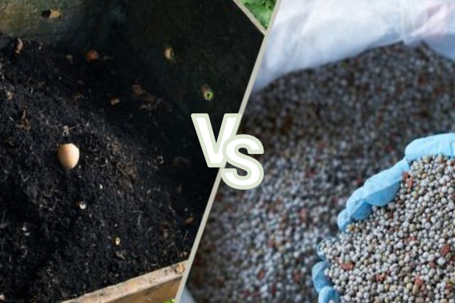
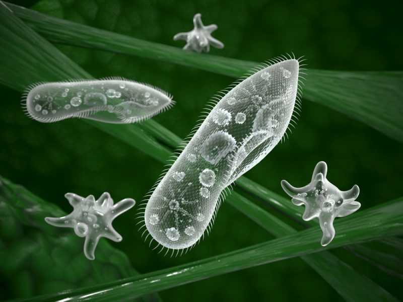
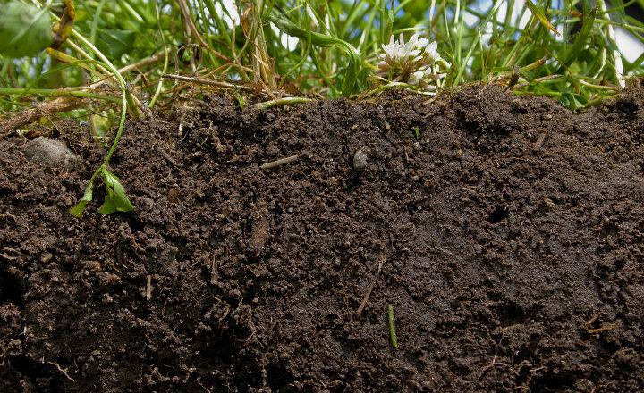
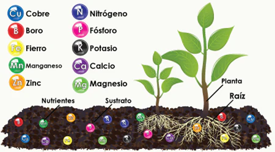

# Abonos Orgánicos vs. Fertilización Artificial

## Abonado Natural (Orgánico)
*   Técnica benigna que favorece la nutrición vegetal.
*   Repara los daños causados por la fertilización química y sintética.
*   Mantiene el crecimiento equilibrado de las plantas y una relación favorable con el suelo.
*   Promueve una agricultura amigable con el ambiente.

## Fertilización Artificial
*   Aporta nutrientes físicos en forma de sales solubles (nitrógeno, fósforo, potasio, calcio, micronutrientes).
*   A largo plazo, causa cambios químicos y físicos en el suelo.
*   Disminuye la carga microbiana.
*   Puede provocar salinidad en el suelo debido a la falta de precisión en la fertilización.

# Los 3 Pilares del Suelo Saludable ("3 M")

La salud del suelo se basa en la interacción de tres componentes clave:

*   **Microorganismos:** Un gramo de suelo puede albergar más de 10.000 millones de microorganismos, esenciales para los ciclos de nutrientes.
  

*   **Materia Orgánica:** Producto de la fotosíntesis (CO2 + H2O), es el carbono y oxígeno principal que, junto con otros elementos, forma la materia orgánica. Representa aproximadamente el 45% del suelo.
   

*   **Minerales (Elementos Nutritivos):**
    *   **Oxígeno, Carbono, Hidrógeno:** Constituyen la mayor parte de la planta (aproximadamente 96%).
    *   **Primarios (NPK):** Nitrógeno, Fósforo, Potasio.
    *   **Secundarios (Ca, Mg, S):** Calcio, Magnesio, Azufre.
    *   **Micronutrimentos (Fe, Cu, Zn, B, Mn, Mo, Ni, Cl):** Hierro, Cobre, Zinc, Boro, Manganeso, Molibdeno, Níquel, Cloro.

# Proceso de Formación de Humus y Mineralización

<audio controls style="width: 100%; max-width: 500px;" 
       controlsList="nodownload" 
       oncontextmenu="return false;">
  <source src="audio/au1.wav" type="audio/wav">
</audio>

El proceso de transformación de la materia orgánica en nutrientes asimilables para las plantas se describe en dos etapas:

## 1. Humificación
*   Conjunto de procesos físicos, químicos y biológicos que transforman la materia orgánica en humus.
*   Proceso rápido (3 a 4 meses) realizado por lombrices, hongos, bacterias y actinomicetos.
*   Puede realizarse en diferentes condiciones ecológicas.

## 2. Humus
*   Estado más avanzado de la descomposición de la materia orgánica.
*   Compuesto coloidal de naturaleza ligno-proteica.
*   Responsable de mejorar las propiedades físico-químicas de los suelos.

## 3. Proceso de Mineralización
*   Transformación del humus en compuestos solubles y asimilables por las plantas (ej. NO3, H2PO4).
*   Proceso lento (aproximadamente 1 año).
*   Requiere condiciones ecológicas óptimas: 18-22°C, buena humedad, oxígeno adecuado, pH de 6.8.
*   Realizado por organismos altamente especializados.

# Fuentes de Materia Orgánica para Abonos

Las fuentes de materia orgánica son diversas y provienen de diferentes actividades:

*   **Actividad Ganadera:** Estiércoles, orines, pelos, plumas, huesos.
*   **Actividad Agrícola:** Rastrojos de los cultivos, residuos de podas de árboles, residuos de malezas.
*   **Actividad Forestal:** Aserrín, hojas y ramas, cenizas.
*   **Actividad Industrial:** Pulpa de café, bagazo de la caña de azúcar.
*   **Actividad Urbana:** Basura doméstica y aguas residuales.

# Objetivo del Uso de Abonos Orgánicos

El uso de abonos orgánicos busca alcanzar una mayor productividad y una producción más sostenible, a través de múltiples beneficios:

*   Menores pérdidas de nutrientes.
*   Menor impacto sobre la materia orgánica estable del suelo.
*   Mayor eficiencia en la nutrición vegetal.
*   Mejora de la estructura del suelo, CIC (Capacidad de Intercambio Catiónico), retención de humedad, porosidad.
*   Mejora el desarrollo de raíces.
*   Propicia menor contaminación ambiental.
*   Mejora el desarrollo de cultivos en condiciones adversas.
*   Impacto positivo sobre la biología del suelo.

**Resultado Global:** Mejor desarrollo y rendimiento de los cultivos, conduciendo a una producción más sostenible y, en última instancia, a **¡MAYOR PRODUCTIVIDAD!**

# Relación entre Sustancia Seca y Humus Producido

| Sustancia Seca (Kg) | Humus Producido (Kg) |
|:--------------------|:---------------------|
| Estiércol: 5 000    | 1 500                |
| Residuos de Remolacha: 6 000 | 900             |
| Residuos de Maíz: 10 000    | 1 500            |
| Residuos de Trigo: 5 000    | 500              |
| Residuos de Girasol: 5 000  | 1 000            |
| Residuos de Sorgo: 7 000    | 700              |
| Residuos de Tabaco: 6 000   | 1 200            |

# Producción de Estiércol y Orines por Animal al Día

| Clase de Animal | Estiércol Sólido (Kg) | Orines (L) |
|:----------------|:----------------------|:-----------|
| Vacuno          | 20 a 30               | 10 a 15    |
| Caballo         | 15 a 20               | 4 a 6      |
| Ovejas          | 1.5 a 2.5             | 0.6 a 1.0  |
| Cerdos          | 1.5 a 2.2             | 2.5 a 4.5  |

## Componentes de una Recomendación (para la fertilización)

Para una recomendación efectiva, se deben considerar los siguientes puntos:

*   **Qué abonar:** Tipo de abono.
*   **Cuánto abonar:** Cantidad de abono.
*   **Cuándo abonar:** Momento oportuno.
*   **Cómo abonar:** Método de aplicación.
*   **Costo:** Aspecto económico (S/.).
*   **Dosis:** Cantidad específica.
*   **Fuente:** Origen del abono.
*   **Método:** Técnica de aplicación.
*   **Época:** Período del año.

# Tipos de Abonos Orgánicos (Ejemplos Visuales)

La presentación muestra ejemplos visuales de diferentes tipos de abonos orgánicos, incluyendo:

*   Lombricomposta
*   Composta
*   Bocashi
*   Biol
*   Abono verde
*   Estiércol

También se muestra una comparación de un cultivo en el "Presente" (antes) y el "Muestro Futuro" (después de la implementación de estas prácticas).

# Composición de Abonos Orgánicos (Resultados de Análisis)

Se presenta una tabla comparativa de la composición de diferentes abonos orgánicos (Guano de Isla, Gallinaza, Estiércol de Cabra, Turba Orgánica) basada en análisis:

| Característica       | Guano de Isla | Gallinaza | Est. Cabra | Turba Orgánica |
|:---------------------|:--------------|:----------|:-----------|:---------------|
| pH                   | 7.60          | 7.60      | 7.70       | 4-5            |
| CE (mmhos/cm)        | Variable      | 8-9       | 9.60       | 0.65           |
| M Orgánica (%)       | 47.60         | 10-12     | 16.00      | 28-30          |
| M. Seca (%)          | 60-70         | 48        | 37         | 70-80          |
| Humedad (%)          | 40-30         | 52        | 63         | 20-30          |
| Cenizas (%)          | 12.80         | 10.60     | 8.20       | 6-8            |
| Nitrógeno Total (%)  | 13-16         | 3-3.20    | 0.80       | 1.20-1.40      |
| Fósforo (%)          | 6-8           | 4-5       | 0.35       | 0.30           |
| Potasio (%)          | 2.20          | 2.7-3.0   | 0.22       | 0.15           |
| Calcio (%)           | 6-7           | 1.60-2.00 | 0.56       | 0.13           |
| Magnesio (%)         | 0.50          | 0.97      | 0.16       | 0.05           |
| Carbono (%)          | 27.60         | 6-7       | 9.28       | 13-16          |

<audio controls style="width: 100%; max-width: 500px;" 
       controlsList="nodownload" 
       oncontextmenu="return false;">
  <source src="audio/au2.wav" type="audio/wav">
</audio>

# Proceso de Compostaje (Fases)

El proceso de compostaje se divide en fases, influenciadas por la relación carbono-nitrógeno C/N y los volteos de la pila (aerar, mezclar y controlar las condiciones del compostaje):

*   **Carbono-Nitrógeno C/N inicial:** 25-30

## Fase Bio-oxidativa (1-2 meses)
*   **Degradación de solubles:** Aumento rápido de temperatura (hasta 60-70°C).
    *   **Fase Mesófila:** Bacterias (Gram-, Proteobacterias, Bacillus, Lactobacillus), Actinomicetos, Hongos (Ascomycota, Zygomycota).
*   **Degradación de polímeros:** La temperatura disminuye gradualmente.
    *   **Fase Termófila:** Bacterias (Bacillus, Thermus, Hydrogenobacter), Actinomicetos (Streptomyces).
*   **Mineralización NH4+:** Liberación de amonio.

## Fase de Maduración (2-4 meses)
*   **Formación de sustancias húmicas:** Temperatura estable y más baja.
    *   **Fase de Enfriamiento:** Bacterias (Gram+), Actinomicetos, Hongos (Ascomycota, Basidiomycota), Protozoos, Nematodos, Estramenopilos.
    *   **Fase de Maduración:** Bacterias (Gram-), Actinomicetos, Hongos (Ascomycota, Zygomycota, Oomycota), Algas, Nematodos.

*   **Carbono-Nitrógeno C/N final:** 10-20
*   **pH:** Tiende a estabilizarse entre 7 y 8.

# ¿Qué es el Bocashi?

*   La palabra "bocashi" en japonés significa "materia orgánica fermentada".
*   Es un abono orgánico sólido.
*   Obtenido mediante un proceso de fermentación aeróbica.
*   Requiere aproximadamente 45 días para su elaboración antes de poder ser utilizado.

## Ingredientes del Bocashi
*   Materia Orgánica
*   Estiércol
*   Carbón
*   Melaza
*   Harina de Rocas
*   Inoculante microbiano
*   Agua

# Conclusión

La presentación destaca la importancia de la fertilización orgánica y las prácticas sostenibles para el mejoramiento del suelo y la salud de los cultivos. La figura final ilustra el ciclo de nutrientes en el suelo, con bacterias fijadoras de nitrógeno, micorrizas que ayudan en la absorción de fósforo, y sideróforos que solubilizan el hierro, mostrando la complejidad y eficiencia de los procesos biológicos en un suelo sano.