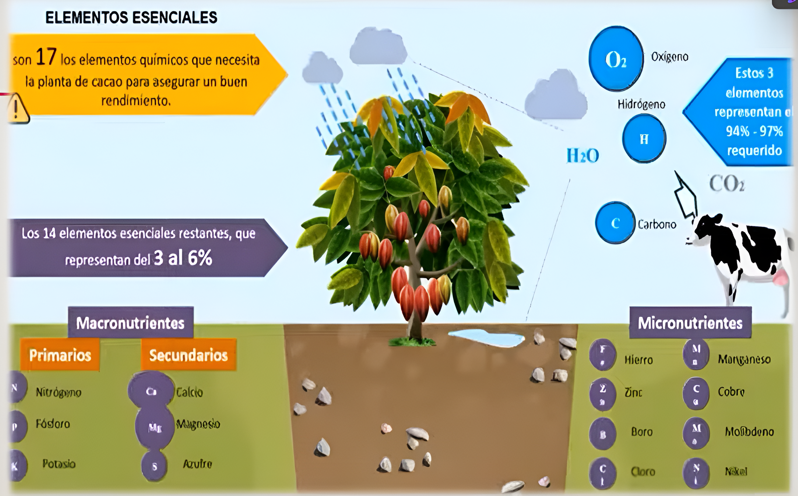
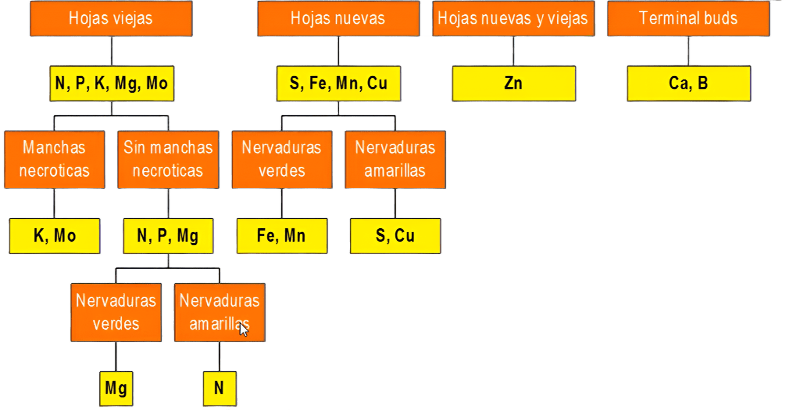

# Abonos Orgánicos: Elementos Esenciales y Procesos

<div style="margin: 20px 0;">
<audio controls style="width: 100%; max-width: 500px;" 
       controlsList="nodownload" 
       oncontextmenu="return false;">
  <source src="audio/au6.wav" type="audio/wav">
</audio>
</div>

## Elementos Esenciales para las Plantas

Las plantas, como el cacao, necesitan 17 elementos químicos para un buen rendimiento.

*   **Elementos principales (94%-97% requeridos):** Oxígeno ($O_2$), Carbono ($CO_2$), Hidrógeno ($H_2O$).
*   **Elementos esenciales restantes (3% al 6%):**
    *   **Macronutrientes:**
        *   **Primarios (NPK):** Nitrógeno (N), Fósforo (P), Potasio (K).
        *   **Secundarios (Ca, Mg, S):** Calcio (Ca), Magnesio (Mg), Azufre (S).
    *   **Micronutrientes (Fe, Mn, Zn, Cu, B, Mo, Cl, Ni):** Hierro (Fe), Manganeso (Mn), Zinc (Zn), Cobre (Cu), Boro (B), Molibdeno (Mo), Cloro (Cl), Níquel (Ni).



## Proceso de Transformación de Abonos Orgánicos

El proceso de conversión de materia orgánica en humus y luego en nutrientes disponibles para las plantas se divide en etapas clave:

1.  **Materia Orgánica:** Residuos orgánicos (estiércol, hojarascas, tallos, etc.).
2.  **Humificación:** Conjunto de procesos físicos, químicos y biológicos que transforman la materia orgánica en humus. Es un proceso rápido (3 a 4 meses) realizado por diversos organismos (lombrices, hongos, bacterias, actinomicetos) en diferentes condiciones ecológicas.
3.  **Humus:** Es el estado más avanzado en la descomposición de la materia orgánica. Es un compuesto coloidal de naturaleza ligno-proteica, responsable de mejorar las propiedades físico-químicas de los suelos.
4.  **Proceso de Mineralización:** Consiste en la transformación del humus en compuestos solubles asimilables por las plantas (ej. $NO_3$, $H_2PO_4$). Es un proceso lento (1 año) que solo se realiza en condiciones ecológicas óptimas (18 a 22°C, buena humedad, oxígeno adecuado, pH 6.8) y por organismos altamente especializados.

## Fuentes de Materia Orgánica para Abonos

Las fuentes son variadas y provienen de distintas actividades:

*   **Ganadera:** Estiércoles, Orines, Pelos, Plumas, Huesos.
*   **Agrícola:** Rastrojos de los cultivos, Residuos de podas de árboles, Residuos de malezas.
*   **Forestal:** Aserrín, Hojas y ramas, Cenizas.
*   **Industrial:** Pulpa de café, Bagazo de la caña de azúcar.
*   **Urbana:** Basura doméstica, Aguas residuales y materias fecales.

## Relación: Sustancia Seca y Humus Producido

| Sustancia Seca (Kg) | Humus Producido (Kg) |
|:--------------------|:---------------------|
| Estiércol: 5 000    | 1 500                |
| Residuos de Remolacha: 6 000 | 900             |
| Residuos de Maíz: 10 000    | 1 500            |
| Residuos de Trigo: 5 000    | 500              |
| Residuos de Girasol: 5 000  | 1 000            |
| Residuos de Sorgo: 7 000    | 700              |
| Residuos de Tabaco: 6 000   | 1 200            |

## Cantidad de Estiércol y Orines Producidos por Animal por Día

| Clase de Animal | Estiércol Sólido (Kg) | Orines (L) |
|:----------------|:----------------------|:-----------|
| Vacuno          | 20 a 30               | 10 a 15    |
| Caballo         | 15 a 20               | 4 a 6      |
| Ovejas          | 1.5 a 2.5             | 0.6 a 1.0  |
| Cerdos          | 1.5 a 2.2             | 2.5 a 4.5  |

## Composición Química de Abonos (Ejemplo)

| Abonos    | Humedad (%) | Nitrógeno (%) | Fósforo ($P_2O_5$) (%) | Potasio ($K_2O$) (%) |
|:----------|:------------|:--------------|:------------------------|:---------------------|
| Vaca      | 75.20       | 1.67          | 1.08                    | 0.56                 |
| Caballo   | 70.00       | 2.31          | 1.15                    | 1.30                 |
| Oveja     | 45.00       | 3.81          | 1.63                    | 1.25                 |
| Llama     | 62.00       | 3.93          | 1.32                    | 1.34                 |
| Vicuña    | 65.00       | 3.62          | 2.00                    | 1.31                 |
| Alpaca    | 63.00       | 3.60          | 1.12                    | 1.29                 |
| Cerdo     | 80.00       | 3.73          | 4.52                    | 2.89                 |
| Gallina   | 40.00       | 6.11          | 5.21                    | 3.20                 |

## Resultados de Análisis de Abonos Orgánicos (Valores Promedio)

| Característica       | Guano de Isla | Gallinaza | Est. Cabra | Turba Orgánica |
|:---------------------|:--------------|:----------|:-----------|:---------------|
| pH                   | 7.60          | 7.60      | 7.70       | 4-5            |
| CE (mmhos/cm)        | Variable      | 8-9       | 9.60       | 0.65           |
| M Orgánica (%)       | 47.60         | 10-12     | 16.00      | 28-30          |
| M. Seca (%)          | 60-70         | 48        | 37         | 70-80          |
| Humedad (%)          | 40-30         | 52        | 63         | 20-30          |
| Cenizas (%)          | 12.80         | 10.60     | 8.20       | 6-8            |
| Nitrógeno Total (%)  | 13-16         | 3-3.20    | 0.80       | 1.20-1.40      |
| Fósforo (%)          | 6-8           | 4-5       | 0.35       | 0.30           |
| Potasio (%)          | 2.20          | 2.7-3.0   | 0.22       | 0.15           |
| Calcio (%)           | 6-7           | 1.60-2.00 | 0.56       | 0.13           |
| Magnesio (%)         | 0.50          | 0.97      | 0.16       | 0.05           |
| Carbono (%)          | 27.60         | 6-7       | 9.28       | 13-16          |

## Objetivo de los Abonos Orgánicos

El uso de abonos orgánicos persigue una **¡MAYOR PRODUCTIVIDAD!** y una **producción más sostenible** mediante:

*   Menores pérdidas de nutrientes.
*   Menor impacto sobre la materia orgánica estable del suelo.
*   Mayor eficiencia en la nutrición vegetal.
*   Mejora de la estructura del suelo, CIC (Capacidad de Intercambio Catiónico), retención de humedad, porosidad.
*   Mejora el desarrollo de raíces.
*   Propicia menor contaminación ambiental.
*   Mejora el desarrollo de cultivos en condiciones adversas.
*   Impacto positivo sobre la biología del suelo.

## Componentes de una Recomendación de Fertilización

Para una recomendación completa, se deben considerar:

*   **Preguntas clave:** Qué abonar?, Cuánto abonar?, Cuándo abonar?, Cómo abonar?
*   **Componentes de la solución:** Dosis, Fuente, Método, Época.
*   **Factor adicional:** Costo.

### Factores para Determinar "Cuánto Abonar"

La cantidad de abono a aplicar está influenciada por:

*   Las exigencias de la planta (especie y variedad).
*   La etapa fenológica del cultivo.
*   El nivel de producción deseado.
*   Las propiedades del suelo.
*   El manejo agrícola general.

## Eficiencia de Nutrientes

La eficiencia de un fertilizante se refiere a la parte del producto aplicado que será realmente disponible para el cultivo y el porcentaje que se preserva de pérdidas.

*   **Fórmula:** Fertilización Aplicada = Requisito de la planta + Aporte del suelo.

### Rangos de Eficiencia de Nutrientes (%)

| Nutriente | F. Tradicional (%) | Fertirriego (%) |
|:----------|:-------------------|:----------------|
| Nitrógeno | 15-50              | 50-80           |
| Fósforo   | 5-30               | 30-40           |
| Potasio   | 30-40              | 40-60           |
| Azufre    | 20-50              | 50-80           |
| Calcio    | 30-40              | 40-60           |
| Magnesio  | 30-40              | 40-60           |

*   **Conclusión:** El fertirriego ofrece una eficiencia de nutrientes significativamente mayor en comparación con la fertilización tradicional.

## Definición de Fertilización (Basada en Análisis)

La fertilización precisa se basa en análisis de laboratorio del suelo y foliares para determinar el estado nutricional y las necesidades del cultivo.

*   **Análisis de Suelos:** Permiten conocer la materia orgánica oxidable, nitrógeno total, fósforo disponible, potasio disponible, pH, conductividad eléctrica, y carbonato de calcio.
*   **Análisis Foliar:** Informan sobre los niveles de macronutrientes (N, P, K, Mg, Ca, S) y micronutrientes (B, Mn, Zn, Cu, Cl) en las hojas.
*   **Gráficos de Monitoreo:** Muestran la evolución de los niveles de nutrientes a lo largo del ciclo del cultivo, permitiendo ajustar las aplicaciones.

# Importancia de las Características del Suelo

Las propiedades del suelo son determinantes para la producción y la planificación de prácticas agrícolas:

| Característica       | Rango Óptimo / Clasificación | Limitación de Producción |
|:---------------------|:-----------------------------|:-------------------------|
| **Salinidad (ms/cm)** | 0-1 (ideal)                  | Sin Limitación           |
|                      | 1-2. (leve)                  | Limitaciones Leves       |
|                      | 2-4 (moderada)               | Limitaciones Moderadas   |
|                      | 6+ (muy severa)              | Limitaciones Severas     |
| **Profundidad (Cm)** | 100 (ideal)                  | Sin Limitación           |
|                      | 75 (leve)                    | Limitaciones Leves       |
|                      | 50 (moderada)                | Limitaciones Moderadas   |
|                      | 20 (severa)                  | Limitaciones Severas     |
| **Acidez o Alcalinidad (pH)** | 5.5-6.0 (ideal)         | Sin Limitación           |
|                      | Otros rangos                 | Limitaciones Variables   |
| **Pregosidad (%)**   | 10% Menos (ideal)            | Sin Limitación           |
|                      | Más de 65% (severa)          | Limitaciones Severas     |
| **Textura**          | Según clasificación          | Limitaciones Variables   |

*   **Categorías de Limitación:** Sin Limitación de Producción, Limitaciones Leves (Prácticas a Implementar), Limitaciones Moderadas (Prácticas a Implementar Específicas), Limitaciones Severas (Prácticas a Implementar Específicas, No ayuda a la producción).

# Análisis de Suelos: Raíces y Composición Ideal

## Características de las Raíces (Suberizadas)

*   **Extensamente suberizado:** Relativamente ineficiente en la absorción de agua.
*   **Baja conductividad hidráulica.**
*   **Susceptible a pudrición radicular.**
*   **Baja frecuencia de pelos radiculares.**
*   Indican un sistema radicular poco eficiente y superficial.

### Distribución Ideal del Sistema Radicular

*   **50% del total de raíces:** 0-30 cm de profundidad.
*   **30-40% del total de raíces:** 30-60 cm de profundidad.
*   **10-20% del total de raíces:** 60-120 cm de profundidad.

### Distribución Ideal de Raíces Activas

*   **80% de raíces activas:** 0-30 cm de profundidad.
*   **20% de raíces activas:** 30-60 cm de profundidad.

## Componentes del Suelo Ideal (Promedios Normales)

*   **Sólidos:** 50%
    *   Minerales: 45%
    *   Orgánicos: 5%
*   **Porosidad:** 40% a 60%
    *   Aire: 20% a 30%
    *   Agua: 20% a 30%

# Reconocimiento de Calidad y Concentraciones

Es crucial diferenciar entre los tipos de análisis de nutrientes:

*   **Análisis de Abonos Orgánicos (Totales):** Obtienen valores que indican la **cantidad total de nutrimento** que existe en la materia seca del producto (ej., 2g de N por cada 100g de materia seca).
*   **Análisis de Suelos (Disponibles):** Proporcionan una "radiografía del momento", indicando la cantidad de nutrientes **inmediatamente disponibles** para las plantas en el suelo.

# Sintomatología de Deficiencias Nutricionales

La observación visual de las hojas puede indicar deficiencias específicas:

*   **Hojas Viejas:**
    *   **Manchas necróticas:** Deficiencia de Potasio (K), Molibdeno (Mo).
    *   **Sin manchas necróticas:** Deficiencia de Nitrógeno (N), Fósforo (P), Magnesio (Mg). (Nervaduras verdes, lámina amarilla -> Mg; Nervaduras amarillas -> N).
*   **Hojas Nuevas:**
    *   **Nervaduras verdes:** Deficiencia de Hierro (Fe), Manganeso (Mn).
    *   **Nervaduras amarillas:** Deficiencia de Azufre (S), Cobre (Cu).
*   **Hojas Nuevas y Viejas (afectación general):** Deficiencia de Zinc (Zn).
*   **Yemas Terminales (Terminal buds):** Deficiencia de Calcio (Ca), Boro (B).



```{r embed-video1, echo=FALSE, results='asis'}
library(vembedr)
embed_url("https://youtu.be/S7-mv2a4j7k?si=mVvjFIvurbX2hDEO")%>%
  use_align("center")
```