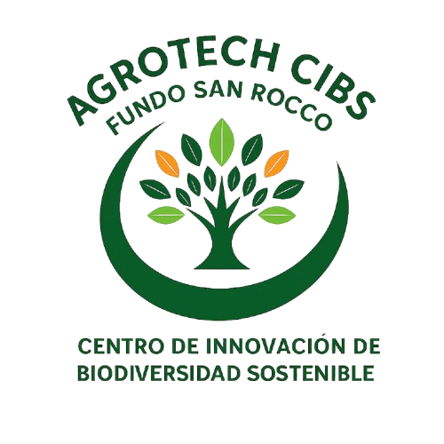

Diseñada para proporcionar una visión clara de la misión de CIBS y facilitar el acceso rápido a todas las secciones clave. Esta sección está pensada para captar la atención de agricultores, técnicos, socios, ofreciendo una experiencia intuitiva, visualmente atractiva y alineada con los principios de bio-industrialización sostenible.

```{r}
#| echo: false
#| warning: false

# Cargar las librerías necesarias
library(langevitour)
library(readr)
library(tibble) # Necesario para la función column_to_rownames

# --- INICIO de la sección de carga y preparación de datos corregida ---

# La ruta a tu archivo CSV. Asegúrate de que este archivo exista en la ruta especificada.
csv_file_path <- "C:/RUSSELL/2R2025/octubre/BLOG/mysite/3ddata.csv"


# Leer el archivo CSV.
# read_csv por defecto toma la primera fila como nombres de columna.
# La primera columna ('Nombre_corto2', 'Análisis de suelo', etc.) se leerá como una columna de datos.
df_temp_raw <- readr::read_csv(csv_file_path, show_col_types = FALSE)

# Para usar langevitour de la forma deseada (cultivos como puntos/filas),
# necesitamos transponer los datos.
# Primero, usamos la primera columna ('Nombre_corto2') como nombres de fila temporalmente.
df_for_transpose <- df_temp_raw %>%
  tibble::column_to_rownames(var = "Nombre_corto2")

# Transponer el dataframe. Ahora, las filas son los cultivos y las columnas son las características.
nuemricdb_transposed <- as.data.frame(t(df_for_transpose))

# Añadir los nombres de los cultivos (que ahora son los nombres de las filas)
# como una columna llamada 'Short_name2', que será usada por langevitour.
nuemricdb <- cbind(Short_name2 = rownames(nuemricdb_transposed), nuemricdb_transposed)
rownames(nuemricdb) <- NULL # Limpiar los nombres de fila si no son necesarios

# Asegurarse de que las columnas de características sean de tipo numérico.
# Esto aplica a todas las columnas excepto la primera ('Short_name2') y la última que añadiremos ('colorhue').
# Es decir, desde la columna 2 hasta la penúltima columna después de añadir 'colorhue'.
# Por ahora, convertimos todas las columnas excepto la primera.
nuemricdb[, -1] <- lapply(nuemricdb[, -1], as.numeric)

# Crear la columna 'colorhue' para agrupar, como se usa en tu llamada a langevitour.
# Esta asignación asume el orden o los nombres específicos de tus cultivos.
nuemricdb$colorhue <- NA # Inicializar la columna con NA
nuemricdb$colorhue[nuemricdb$Short_name2 == "Vainilla"] <- "low"
nuemricdb$colorhue[nuemricdb$Short_name2 == "Café"] <- "low"
nuemricdb$colorhue[nuemricdb$Short_name2 == "Palta"] <- "medium"
nuemricdb$colorhue[nuemricdb$Short_name2 == "Pitahaya"] <- "medium"
nuemricdb$colorhue[nuemricdb$Short_name2 == "Miel"] <- "high"

# Convertir 'colorhue' a un factor con niveles específicos para asegurar
# el orden correcto de los colores en la visualización.
nuemricdb$colorhue <- factor(nuemricdb$colorhue, levels = c("low", "medium", "high"))

# --- FIN de la sección de carga y preparación de datos corregida ---
```

```{r}
#| echo: false
#| warning: false
#| fig-align: center
#| fig-width: 8
#| fig-height: 6
#| out-width: "100%" # Usa todo el ancho disponible del área de texto
#| out-height: "500px"

state1 = c('{
    "axesOn": true,
    "heatOn": true,
    "guideType": "local",
    "labelAttractionOn": true,
    "damping": -2.59,
    "heat": 2.05,
    "guide": -2,
    "labelAttraction": -0.56,
    "labelInactive": [
        "fluorescence",
        "ecotoxicity",
        "smell",
        "complexity",
        "cleaning-clothes",
        "cleaning-surface",
        "colorhue"
    ],
    "labelPos": {},
    "projection": [
        [
            0.49966457845166484,
            0.314906763701451,
            0.06587308043381697,
            -0.2793800688196538,
            -3.753356221065898e-52,
            -0.23236415343494143,
            0.19410767560517234,
            -0.1285605562206543,
            -1.6489983583104964e-51,
            -8.408242997351756e-48,
            0.1464703521916647,
            0.18336575757590418,
            0.2699007288867679,
            -6.597260689827245e-47,
            -0.38594535564271215,
            -0.41153880140930776,
            1.7139985937625593e-25,
            -3.668278972961867e-46,
            -0.09558586334759378,
            0.033697362895731234,
            0.015979622295406365,
            -1.4200669913659788e-56,
            0.06172000032138229
        ],
        [
            0.15066619449919066,
            -0.3072798657284068,
            0.14264641817335527,
            0.03895182014726703,
            2.6662865415382193e-52,
            -0.289036433453587,
            0.13242022910003706,
            0.0794447655447277,
            1.1714051146036008e-51,
            5.972993675946225e-48,
            -0.04440583115317507,
            -0.5949550418770497,
            -0.1630376370436355,
            4.686537322887235e-47,
            -0.3209827752245519,
            -0.002329079909824422,
            -1.2175706235010028e-25,
            2.605846804924196e-46,
            0.3153942366295783,
            -0.16348702406224655,
            0.3683664866969888,
            1.0087783757731135e-56,
            0.07854598577974181
        ]
    ]
')

# Llamada a la función langevitour con los datos preparados
langevitour::langevitour(
  3 * scale(nuemricdb[, -c(1, ncol(nuemricdb))], center = FALSE, scale = TRUE),
  name = nuemricdb$Short_name2,
  pointSize = 6,
  group = nuemricdb$colorhue,
  levelColors = c("#FFFFCC", "#FFCC00", "#666600"),
  state = state1,
  width = "100%",    # Usa todo el ancho del contenedor de texto
  height = "500px"   # Altura fija
)
```

El Centro de Innovación y Biotecnología Sostenible (CIBS) Fundo San Rocco lidera la agricultura del futuro en la Amazonía peruana, transformando bioactivos como vainilla, pitahaya; en productos para mercados globales. Con tecnologías como extracción con CO2 supercrítico, liofilización y el ecosistema digital, promovemos una agricultura sostenible, rentable y resiliente al clima, basada en la economía circular.


